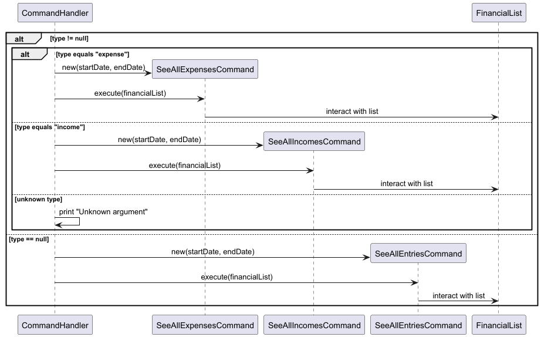
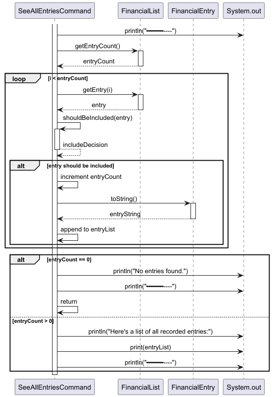

# Developer Guide

## Acknowledgements

{list here sources of all reused/adapted ideas, code, documentation, and third-party libraries -- include links to the original source as well}

## Design & implementation

{Describe the design and implementation of the product. Use UML diagrams and short code snippets where applicable.}
#### Listing Entries

Overview

## Product scope
### Target user profile
The list entries feature is facilitated by `SeeAllEntriesCommand`. 

{Describe the target user profile}
When the user inputs `list [income|expense] [/from START_DATE] [/to END_DATE]`, the following logic is carried out.

### Value proposition

{Describe the value proposition: what problem does it solve?}
The interaction between `SeeAllEntriesCommand` 
with the `FinancialList` is as follows:

## User Stories

|Version| As a ... | I want to ... | So that I can ...|
|--------|----------|---------------|------------------|
|v1.0|new user|see usage instructions|refer to them when I forget how to use the application|
|v2.0|user|find a to-do item by name|locate a to-do without having to go through the entire list|

## Non-Functional Requirements

{Give non-functional requirements}

## Glossary

* *glossary item* - Definition

## Instructions for manual testing

{Give instructions on how to do a manual product testing e.g., how to load sample data to be used for testing}
